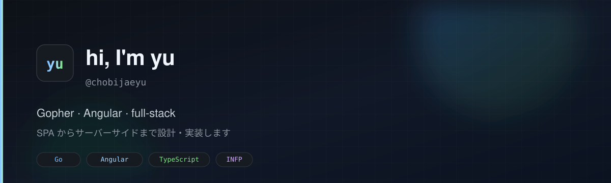

<div align="center">
  
</div>

<br />

<div align="center">
  <a href="https://git.io/typing-svg">
    
  </a>
</div>

---

### About

Full-stack engineer who likes clear boundaries and simple systems.  
普段は **Go** と **Angular** で SPA から API、インフラまで一気通贯で作っています。

喜欢把复杂问题拆成干净的接口，再选最朴素能跑的方案落地。

```text
$ whoami
yu · chobijaeyu · INFP · γ Mic
```

---

### Stack

<p align="center">
  <a href="https://skillicons.dev">
    
  </a>
</p>

| Layer | Prefer |
| :--- | :--- |
| Backend | Go (Gin / stdlib), REST, a bit of Python |
| Frontend | Angular, TypeScript |
| Infra | Docker, GitHub Actions, Cloudflare |
| Focus | AI apps, voice input, developer tools |

---

### Now

- Building **[SayIt](https://github.com/chobijaeyu/SayIt)** - 语音输入 + AI 润色，开源 Typeless 替代  
  `https://sayitapp.site`
- Daily Go / Angular. Occasional CLI and toolchain tinkering.

<p align="center">
  <a href="https://github.com/chobijaeyu/SayIt">
    
  </a>
</p>

---

### GitHub

<p align="center">
  
  
</p>

---

<div align="center">

**Open to interesting engineering conversations.**

`Go · Angular · TypeScript · Cloudflare`

</div>
