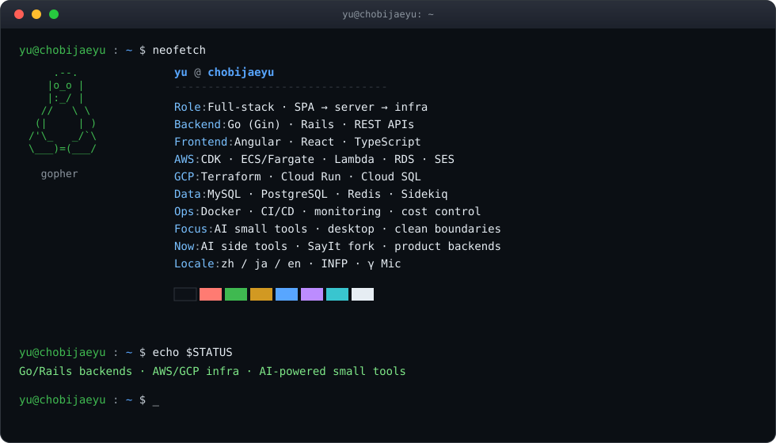

<div align="center">
  
</div>

```bash
# -----------------------------------------------------------------------------
#  session: github.com/chobijaeyu
#  shell:   zsh · mode: engineer
# -----------------------------------------------------------------------------

$ cat ~/README.md
```

```text
yu · full-stack engineer · zh / ja / en

SPA から API、バッチ、クラウド基盤まで一気通貫で作るエンジニア。
本業は Rails / Go のバックエンドと Angular / React のフロントエンド。
AWS CDK / Terraform でインフラを書き、監視とコストまで面倒を見る。
业余用 AI 做小工具：桌面端、脚本，先做到自己每天都在用。

複雑さは敵。境界が綺麗なら実装は勝手に簡単になる。
```

```bash
$ tree ~/stack -L 1
```

```text
stack/
├── backend/     Go (Gin) · Rails 7/8 · REST · Sidekiq · Redis
├── frontend/    Angular · React · TypeScript · Vite
├── desktop/     Tauri · Rust · macOS system hooks · Swift
├── aws/         CDK · ECS/Fargate · Lambda · RDS · SES · EventBridge
├── gcp/         Terraform · Cloud Run · Cloud SQL · Cloud Armor
├── data/        MySQL · PostgreSQL · Redis · pgvector
├── ops/         Docker · GH Actions · Cloud Build · monitoring
└── focus/       AI-powered small tools · desktop · clean boundaries
```

<p align="left">
  
</p>

```bash
$ journalctl -u work --since "recent" --no-pager
```

```text
[work]  Rails backends for wellness / enterprise products
        MySQL · Sidekiq · Redis · Puma · Dockerized deploy

[work]  AWS infrastructure as code
        CDK (TypeScript) · ECS/Fargate + Aurora
        Lambda automation · SES monitoring · STG cost hibernation

[work]  Go services
        Gin APIs · workers · push / product backends

[work]  Cloud platform (GCP)
        Terraform modules · Cloud Run · Cloud SQL · WAF / LB
        observability + CI/CD for multi-env shipping
```

```bash
$ ls ~/projects/
```

```text
SayIt/                    # fork of crosswk/SayIt · deep macOS work
  voice input + AI polish (open-source Typeless-class tool)
  upstream owns product design / Windows / cloud UX — credit them first
  our work on this fork:
    · macOS client: global hotkeys (CGEventTap), paste inject, a11y flow
    · OpenAI-compat ASR (OpenRouter / OpenAI), ASR ≠ polish providers
    · 中翻日 / 中翻英 presets, fail-closed translation paste
    · history 「学习」+ structured learning, recording stability fixes
    · path_guard + install script with stable adhoc codesign id
  https://github.com/chobijaeyu/SayIt
  https://sayitapp.site

AWSResourceHibernator/    # own
  Lambda that parks STG EC2 / ECS / RDS off-hours
  https://github.com/bstu-j-yang/AWSResourceHibernator

QuickTOTP/                # own · Raycast extension
  TOTP codes for local / stg / prod in one list
  paste or copy the live code, otpauth:// URI import
  secrets stay in Raycast's local encrypted storage
  https://github.com/chobijaeyu/QuickTOTP

teslapse/                 # own · ffmpeg + bash
  Tesla Sentry / Dashcam events → frames → timelapse
  single camera or multi-camera layouts, fully local
  https://github.com/chobijaeyu/teslapse
```

```bash
$ gh repo view chobijaeyu/SayIt --web
```

<p align="left">
  <a href="https://github.com/chobijaeyu/SayIt">
    
  </a>
  <a href="https://github.com/bstu-j-yang/AWSResourceHibernator">
    
  </a>
  <a href="https://github.com/chobijaeyu/QuickTOTP">
    
  </a>
  <a href="https://github.com/chobijaeyu/teslapse">
    
  </a>
</p>

```bash
$ neofetch --stats
```

<p align="left">
  
  
</p>

```bash
$ cat ~/motd
```

```text
open to interesting engineering conversations.
best ping topics: Go, Rails, AWS/GCP infra, AI small tools, desktop apps.

exit 0
```
